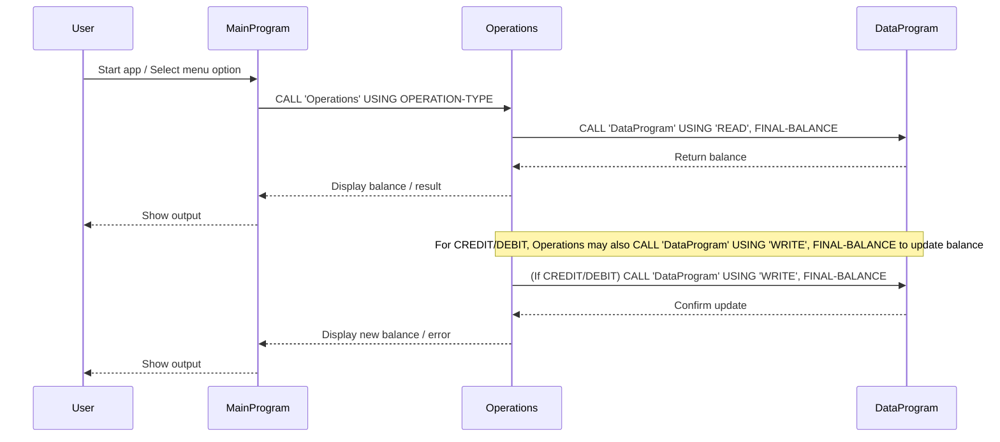

# COBOL Student Account Management System

This project demonstrates a simple student account management system written in COBOL. The system allows users to view their account balance, credit (add) funds, and debit (subtract) funds, with persistent balance storage.

## Purpose of Each COBOL File

### `main.cob`
- **Purpose:** Entry point and main menu for the application.
- **Key Functions:**
  - Displays a menu for account operations: View Balance, Credit Account, Debit Account, Exit.
  - Accepts user input and calls the appropriate operation via the `Operations` program.
- **Business Rules:**
  - Only allows choices 1-4; prompts again for invalid input.
  - Loops until the user chooses to exit.

### `operations.cob`
- **Purpose:** Handles the logic for each account operation.
- **Key Functions:**
  - Receives the operation type from `main.cob` (TOTAL, CREDIT, DEBIT).
  - For `TOTAL`: Calls `DataProgram` to read and display the current balance.
  - For `CREDIT`: Prompts for an amount, reads the balance, adds the amount, writes the new balance, and displays it.
  - For `DEBIT`: Prompts for an amount, reads the balance, checks for sufficient funds, subtracts the amount if possible, writes the new balance, and displays it. If insufficient funds, displays an error.
- **Business Rules:**
  - Prevents debiting more than the available balance.
  - All balance updates are persisted via `DataProgram`.

### `data.cob`
- **Purpose:** Manages persistent storage of the account balance.
- **Key Functions:**
  - Receives operation type (READ or WRITE) and a balance value.
  - For `READ`: Returns the current stored balance.
  - For `WRITE`: Updates the stored balance with the provided value.
- **Business Rules:**
  - All balance changes are centralized here for consistency.
  - Initial balance is set to 1000.00.

## Business Rules Summary
- Only valid menu options (1-4) are accepted.
- Debit operations cannot exceed the current balance.
- All balance changes are immediately persisted.
- Initial balance is 1000.00 for each session.

---

For more details, see the source code in `/src/cobol/`.

---

## Application Data Flow (Sequence Diagram)

